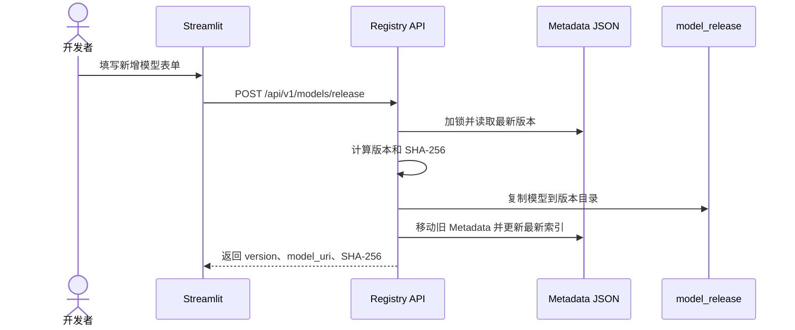

# Tuojing Model Platform Service 架构设计

> 状态：Draft v0.2

## 1. 目标

提供一个简单的内部模型入库服务。开发者只提交模型目录和必要信息，平台自动完成版本计算、SHA-256、Metadata 和统一目录发布。

当前只解决模型制品的直接发版和查询，不负责模型推理服务。

## 2. 系统边界

本服务负责：

- 接收模型目录；
- 自动递增模型版本，也允许指定版本；
- 计算 SHA-256 并生成 Metadata；
- 发布到 `/data/model-registry/model_release`；
- 维护最新模型索引和全部历史记录；
- 查询模型路径、版本和元数据。

本服务暂不负责模型环境划分、跨环境迁移、训练、在线推理、GPU 调度和业务应用部署。

## 3. 总体架构

```mermaid
flowchart LR
    DEV[开发者] --> UI[Streamlit 页面]
    UI --> API[Model Registry API]
    API --> VERSION[计算目标版本]
    VERSION --> CHECK[校验与 SHA-256]
    CHECK --> RELEASE[/data/model-registry/model_release]
    CHECK --> META[/data/model-registry/model_meta]
    API --> RESULT[version + model_uri + SHA-256]
```

## 4. 存储目录

路径统一使用 `/data/model-registry`：

```text
/data/model-registry/
├── model_release/
│   └── <project_name>/
│       └── <model_name>/
│           └── <version>/
│               └── copied model directory contents
└── model_meta/
    ├── model_meta.json
    └── model_meta_record.json
```

固定层级为：

```text
项目名称 → 模型名称 → 模型版本 → 模型文件
```

必须增加版本目录，否则默认递增、指定版本和历史模型会写到同一个位置。

版本目录默认不可覆盖。只有发版请求显式设置 `force_replace=true` 时才允许替换。

## 5. Metadata

### 5.1 model_meta.json

只保存每个模型的最新版本，作为快速查询索引：

```json
{
  "schema_version": "model-meta.v1",
  "models": {
    "Umi2Isaac/umi-policy": {
      "project_name": "Umi2Isaac",
      "model_name": "umi-policy",
      "version": "0.0.2",
      "model_uri": "/data/model-registry/model_release/Umi2Isaac/umi-policy/0.0.2/",
      "sha256": "<full-sha256>",
      "released_by": "alice",
      "released_at": "2026-08-30T08:30:00Z"
    }
  }
}
```

### 5.2 model_meta_record.json

保存已经不再是最新版本的历史 Metadata：

```json
{
  "schema_version": "model-meta-record.v1",
  "records": [
    {
      "project_name": "Umi2Isaac",
      "model_name": "umi-policy",
      "version": "0.0.1",
      "model_uri": "/data/model-registry/model_release/Umi2Isaac/umi-policy/0.0.1/",
      "sha256": "<full-sha256>",
      "released_by": "alice",
      "released_at": "2026-08-29T08:30:00Z"
    }
  ]
}
```

新版本发布时，旧的最新 Metadata 移入 `model_meta_record.json`，新的 Metadata 写入 `model_meta.json`。`released_by` 由用户选填，`released_at` 由服务自动生成 UTC 时间；强制替换不额外增加操作类型字段。

两个文件必须在同一个文件锁内更新，并使用临时文件加原子 rename，避免并发发版损坏 JSON。

## 6. model_uri

MVP 中 `model_uri` 直接保存模型版本目录，并保留到版本层级：

```text
/data/model-registry/model_release/Umi2Isaac/umi-policy/0.0.2/
```

目录中可以包含一个模型文件，也可以包含权重、配置、Tokenizer 等多个文件。业务代码根据自己的模型类型读取目录内容。

## 7. 版本规则

版本格式使用 `MAJOR.MINOR.PATCH`。假设最新版本为 `1.2.3`：

| 操作 | 请求字段 | 新版本 |
|---|---|---|
| 默认发版 | 不传 `version_strategy` | `1.2.4` |
| 递增中版本 | `version_strategy=minor` | `1.3.0` |
| 递增大版本 | `version_strategy=major` | `2.0.0` |
| 指定新版本 | `version_strategy=exact, version=1.5.0` | `1.5.0` |
| 替换已有版本 | `version=1.2.3, force_replace=true` | `1.2.3` |

如果模型从未发布，默认第一个版本为 `0.0.1`。

规则：

- 默认从 `model_meta.json` 读取最新版本并递增 PATCH；
- MINOR 加一时 PATCH 归零；
- MAJOR 加一时 MINOR、PATCH 归零；
- `version_strategy=exact` 时必须提供精确版本，目标已存在时默认失败；
- 只有 `force_replace=true` 才允许替换已有版本；
- 精确版本和自动递增策略互斥；
- 更新前的旧 Metadata 移入历史文件，新的 Metadata 写入最新索引。

指定版本和强制替换拆成两个字段，避免输入一个版本时意外覆盖已有模型。

## 8. 强制替换

```json
{
  "project_name": "Umi2Isaac",
  "model_name": "umi-policy",
  "source_path": "/data/workspace/umi-policy/",
  "version_strategy": "exact",
  "version": "1.2.3",
  "force_replace": true
}
```

处理顺序：

```text
锁定 Metadata
→ 校验目标版本
→ 将旧 Metadata 移入历史文件
→ 复制并校验新模型
→ 替换目标版本目录
→ 更新最新索引
→ 释放锁
```

MVP 不单独记录强制替换事件。新旧 Metadata 都保留各自的 `released_by` 和 `released_at`，但旧模型文件会被替换，因此 `force_replace` 不提供旧模型恢复能力。

## 9. 模型发布流程



默认发版请求：

```json
{
  "project_name": "Umi2Isaac",
  "model_name": "umi-policy",
  "source_path": "/data/workspace/umi-policy/",
  "released_by": "alice"
}
```

递增中版本请求：

```json
{
  "project_name": "Umi2Isaac",
  "model_name": "umi-policy",
  "source_path": "/data/workspace/umi-policy/",
  "released_by": "alice",
  "version_strategy": "minor"
}
```

## 10. Streamlit 页面

MVP 提供两个页面：

### 新增模型

使用 Streamlit Form 一次提交以下字段：

```text
project_name
model_name
source_path
released_by        optional
version_strategy   optional: patch/minor/major/exact
version            required when strategy is exact
force_replace      optional: false by default
```

提交后页面展示最终版本、模型目录、SHA-256、发布人和自动生成的发布时间。

### 查询模型

支持按项目名称、模型名称和版本筛选，并提供“只看最新版本”选项。查询结果使用表格展示。

Streamlit 只负责页面和表单，不直接读写模型与 Metadata；所有操作统一调用 FastAPI。

## 11. 初始 API

MVP 只保留两个业务接口和一个健康检查：

```text
POST /api/v1/models/release
POST /api/v1/models/query
GET  /api/v1/health
```

查询接口统一使用请求体：

```json
{
  "project_name": "Umi2Isaac",
  "model_name": "umi-policy",
  "version": "0.0.2",
  "latest_only": false
}
```

除 `latest_only` 外，其他查询字段都可以为空。这样 Streamlit 可以使用同一个接口完成全部查询，不要求客户端拼接多组 URL 路径。

### source_path

`source_path` 是开发者提供的模型目录路径，例如：

```text
/data/workspace/umi-policy/
```

路径必须是绝对路径并真实存在，目录最后一级名称必须与 `model_name` 相同。服务端必须能够访问这个路径。MVP 要求开发机器和服务共享 `/data`，并且只允许读取配置好的 `/data` 白名单目录。

服务处理方式：

```text
校验 source_path 是绝对路径、真实目录且位于允许目录
→ 校验目录名等于 model_name
→ 校验服务用户拥有目录遍历和文件读取权限
→ 校验软链接目标存在且仍在 workspace 内
→ 解除软链接并将真实内容复制到目标版本的临时目录
→ 按相对路径排序并计算目录 SHA-256
→ 原子 rename 为正式版本目录
→ 更新两个 Metadata 文件
```

如果路径只存在于开发者个人电脑、服务端看不到，就不能使用 `source_path`，后续需要另行增加文件上传能力。

权限不足时返回 `403`，响应同时包含 `suggested_command`。命令使用 ACL 只给当前 API 服务用户增加目录遍历与只读权限；服务只生成建议，不自动修改开发者目录权限。

源目录允许软链接，但目标必须真实存在、可读且仍位于配置的 workspace 内。复制时保存目标的真实内容，不在正式版本中保留软链接；失效链接、跨 workspace 链接和循环链接直接拒绝。

## 12. 与业务项目和 CI/CD 的关系

模型发布成功后，业务项目只记录：

```yaml
model:
  project_name: Umi2Isaac
  model_name: umi-policy
  version: 0.1.0
  model_uri: /data/model-registry/model_release/Umi2Isaac/umi-policy/0.1.0/
  sha256: <full-sha256>
```

业务 Wheel 不携带模型文件，只提供加载和校验逻辑。模型平台发布模型，`Tuojing_platform_cicd` 发布业务代码 Wheel。

GitHub-hosted CI 没有 `/data/model-registry`，因此只校验模型配置格式；真实模型加载测试留给开发机器或后续集群 Runner。

## 13. 并发、安全和恢复

- 同一时间只允许一个进程更新两个 Metadata 文件；
- Metadata 使用临时文件写入成功后原子 rename；
- 普通发版禁止覆盖已有版本；
- `force_replace=true` 才允许替换已有版本；
- 模型正式目录对普通使用者只读；
- 发布前验证源路径存在、为绝对路径，并验证服务用户的复制权限；
- 发版失败时不得更新最新索引；
- `model_meta.json` 可以由历史记录和版本目录重建。

## 14. 路线图

- [ ] 定义两个 Metadata JSON Schema；
- [x] 实现 Streamlit 新增和查询页面；
- [x] 实现默认 PATCH、MINOR、MAJOR 和指定版本规则；
- [x] 实现 FastAPI 统一发版和查询接口；
- [x] 实现 `source_path` 绝对路径、存在性、目录名、权限、软链接、白名单、复制、SHA-256 和目录发布；
- [x] 实现 Metadata 文件锁和原子更新；
- [x] 实现 `force_replace`；
- [ ] 增加鉴权、备份和恢复测试；
- [ ] 数据规模或并发增长后，将 Metadata 从 JSON 迁移到数据库。
